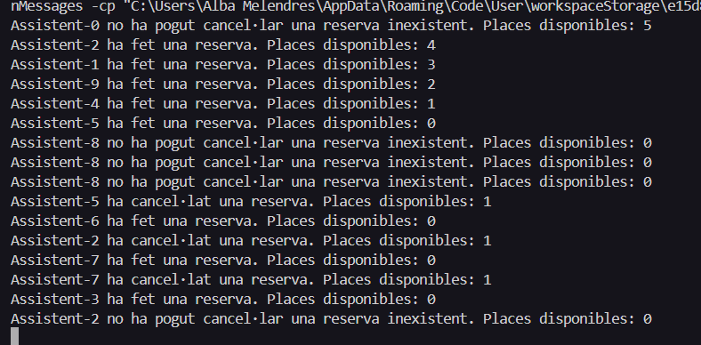
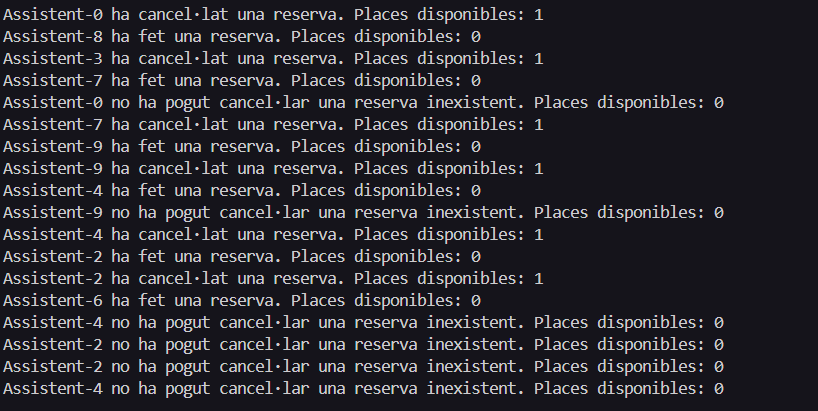

### 1. Per què s'atura l'execució al cap d'un temps?

El programa en si no s'atura, perquè els fils estan dissenyats per executar-se contínuament.  
Tot i això, a la consola pot semblar que està com “parat” si molts assistents intenten fer accions que no produeixen missatges visibles, com per exemple intentant cancel·lar reserves que no existeixen o intentant reservar quan no hi ha places disponibles.

---

### 2. Què passaria si en lloc de una probabilitat de 50%-50% fora de 70%(ferReserva)-30% (cancel·lar)? I si foren al revés les probabilitats? → Mostra la porció de codi modificada i la sortida resultant en cada un dels 2 casos

#### a) 70% ferReserva – 30% cancel·lar
exemple del codi:

```
@Override
    public void run() {
        while (true) {
            try {
                if (Math.random() < 0.7) {
                    esdeveniment.ferReserva(this);  //50%
                } else {
                    esdeveniment.cancelaReserva(this);  // 50%
                }
                Thread.sleep((int) (Math.random() * 1000)); // per esperar un temps aleatori entre 0 i 1
                
            } catch (InterruptedException e) {
                break;
            }
        }
    }
```

Exemple del resultat: 



Com es pot apreciar a la imatge el que passaria és que l'esdeveniment estaria practicament complet sempre, i les vegades en que s'allibera una plaça, aquesta es tornaria a reservar inmediatament.

#### b) 30% ferReserva – 70% cancel·lar
exemple del codi:

```
@Override
    public void run() {
        while (true) {
            try {
                if (Math.random() < 0.3) {
                    esdeveniment.ferReserva(this);  //50%
                } else {
                    esdeveniment.cancelaReserva(this);  // 50%
                }
                Thread.sleep((int) (Math.random() * 1000)); // per esperar un temps aleatori entre 0 i 1
                
            } catch (InterruptedException e) {
                break;
            }
        }
    }
```

exemple del resultat:



El resultat es que les reserves es produeixen més lentament i també es produeixen molts intents de cancela sense tindre reserva.
--- 

### 3. Per què calen llistes en lloc d'una simple variable sencera?
La llista és necessària per poder identificar exactament quins assistents tenen reserva.
Permet verificar que un assistent no faci una reserva duplicada o que no cancel·li una reserva que no té.

Una simple variable només indicaria el nombre total de reserves, sense saber qui les té.